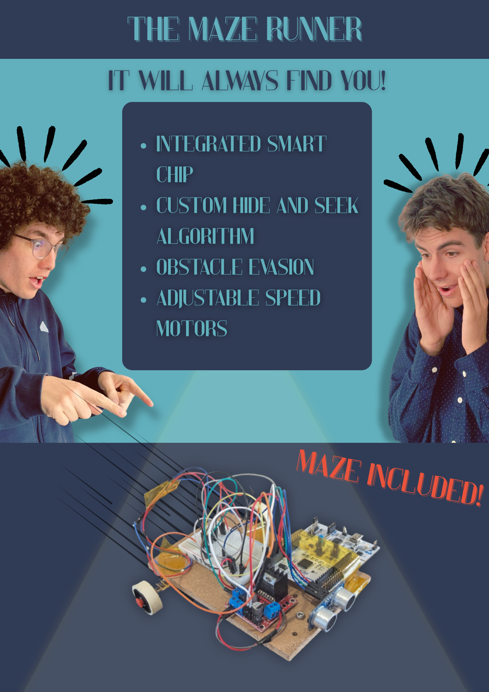

# SAS25A_ENSEA_PROJET_S6

This repository contains the code and documentation for our first year school project. An embedded systems project using STM32CubeIDE to build a robot that plays hide and seek in a labyrinth using motors for moving, an ultrasonic sensor for obstacle detection, and an infrared sensor for detecting the other playing robot.

## Table of Contents
- [Project Overview](#project-overview)
- [Team Members](#team-members)
- [How to Use](#how-to-use)
- [Folder Structure](#folder-structure)
- [Documentation](#documentation)

## Project Overview

This embedded systems project aimed to build a robot capable of playing a game of hide-and-seek using sensors and motor control, based on the STM32L476RG microcontroller, in a compact design with an integrated PCB.

### What We Achieved
- The robot can **move forward** using DC motors
- It **stops automatically** when an obstacle is detected via the ultrasonic sensor
- It **blinks an LED** when receiving a signal from the infrared receiver
- A PCB design ready to print

### What Was Not Fully Implemented
- Autonomous hide-and-seek behavior
- Navigation or decision-making logic
- Compact design with an integrated PCB

Despite not reaching the original goal, the project successfully integrates core embedded system concepts such as motor control, sensor interfacing, and interrupt-based signaling.

## Team Members

- BELLAHBIB Amate-Allah 
- EL MESTARI Mohamed-Amine 
- NASSCHAERT Florent 
- PERRIN Maël 
- ZEAITER Yehia 

### Contributions

| Member       | Contributions Summary                                                                                   |                    
|--------------|---------------------------------------------------------------------------------------------------------|
| Amate-Allah  | PCB design, infrared sensor testing, final presentation, final report                                   |
| Mohamed-Amine| Ultrasonic sensor testing, weekly reports, final report                                                 |
| Florent      | Infrared sensor testing, programming, timer setup, algorithm diagram                                    |
| Maël         | Stepper motors testing, 3D modeling, GANTT diagram                                                      |
| Yehia        | Ultrasonic sensor testing, DC and stepper motors testing, timer setup, SADT diagram, task distribution  |

## How to use

## Folder structure
- `STM_Project/`: STM32CubeIDE project files
- `report.docx`: Final report
- `guides/`: how to guides

## Documentation

